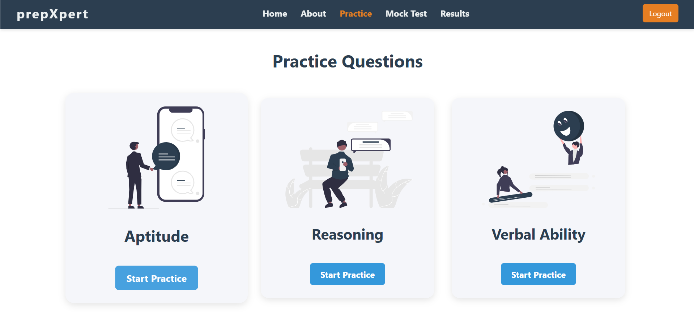

# prepXpert

    

## Contents
1. ABOUT 
2. TECH SLACK
3. GALLERY
4. FUTURE WORK
5. CONTRIBUTIONS
6. WEBSITE 
7. LICENSE

## About
- prepXpert is your one-stop platform to prepare for competitive exams with confidence.
- Practice Aptitude, Reasoning, and Verbal Ability questions by topic and take full-length mock tests.
- Users can register and log in to track their performance, while admins can add and manage new questions.
- Built with an interactive UI, secure backend, and smart test generation features, prepXpert helps you sharpen your skills and analyze your progress effectively.

## Tech Slack
- [Reactjs-Frontend](https://react.dev/)
- [GoLang-Backend](https://go.dev/)
- [PostgreSQL-DataBase](https://www.postgresql.org/)

## Gallery

    

    

    

    

    

    

    

    

## Future work
- 🔐 Role-based Access Control – Fine-grained roles for users and admins.
- 📊 Performance Analytics – Visual reports of user progress over time.
- 💡 AI-Powered Recommendations – Suggest practice questions based on weak topics.
- 🎯 Timed Test Mode – Add time-bound tests to simulate real exam pressure.
- 📱 Responsive UI Overhaul – Improve layout for mobile users.

## Contributions
- All contributions and suggestions are welcome .
- Start with issues and for more features write to <a href ="mailto:likhithaindukuri07@gmail.com">likhithaindukuri07@gmail.com</a>

## Website

- <a href="https://github.com/likhithaindukuri/prepXpert">prepXpert</a>

## Licence
- ***GNU GENERAL PUBLIC LICENSE***

